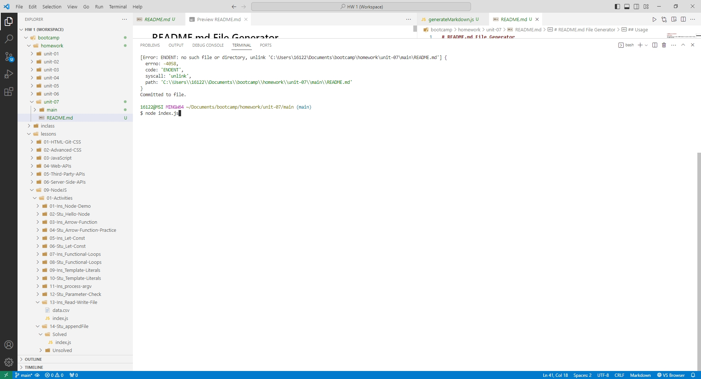
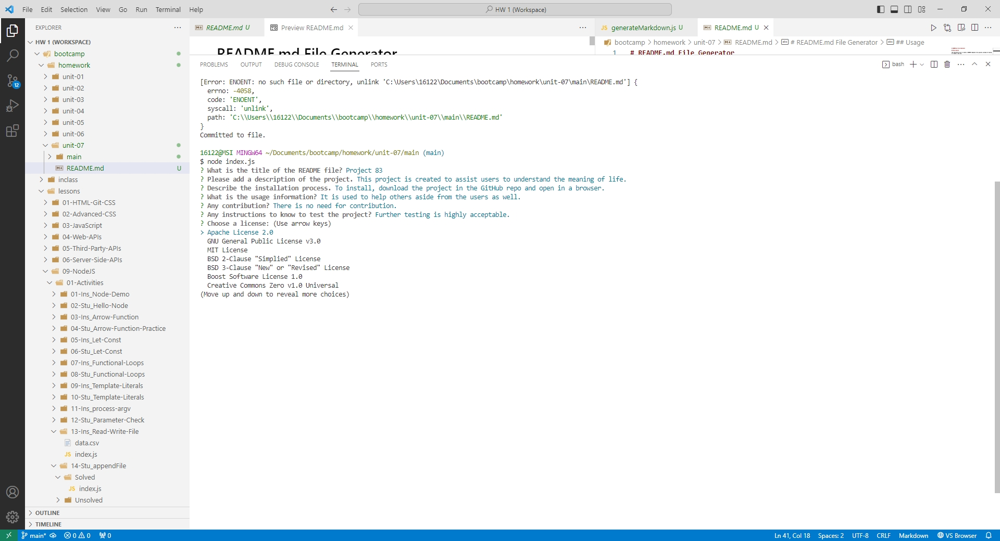

# README.md File Generator

## Description

The motivation was to create a README template file quickly instead of having to create a new one.

I build this project, because there are some users that want to save time by getting the formats and templates ready instead of having to type everything in the file.

The problems involve inexperienced users to quickly create a README.md file instead of using their time to create a new one.

I learned that Markdown isn't a bad language as it is.

## Table of Contents

If your README is long, add a table of contents to make it easy for users to find what they need.

- [Installation](#installation)
- [Usage](#usage)
- [Credits](#credits)
- [License](#license)
- [Badges](#badges)
- [Features](#features)
- [HowToContribute](#how-to-contribute)
- [Tests](#tests)

## Installation

What are the steps required to install your project? Provide a step-by-step description of how to get the development environment running.

1. Download the repo zipped folder.
2. Unzip the zipped folder.
3. Run the index.js file in a terminal that have node.js installed.

## Usage

Run node index.js in the main folder and a new README.md file will be generated.

Video Demonstration:
https://watch.screencastify.com/v/Uw0fgeAFlbm1nELXCHXx

GitHub Repo Link:
https://github.com/Jasony95/read-me-generator

Running index.js:

Input for Title:

Input for Description:

Input for Installation:

Input for Usage:

Input for Contribution:

Input for Testing:

Choosing License:

Input for Username:

Input for Email:

Results:

File:

Preview:

## Credits

Sources:
1. https://docs.github.com/en/repositories/managing-your-repositorys-settings-and-features/customizing-your-repository/licensing-a-repository
2. https://dillinger.io/
3. https://docs.github.com/en/communities/setting-up-your-project-for-healthy-contributions/adding-a-license-to-a-repository
4. https://www.npmjs.com/package/markdown-it
5. https://stackoverflow.com/questions/73147231/best-way-to-write-markdown-content-in-node-js
6. https://stackoverflow.com/questions/6110953/how-to-print-out-a-markdown-file-on-the-console-using-node-js
7. https://gist.github.com/lukas-h/2a5d00690736b4c3a7ba
8. https://nodejs.org/api/fs.html#fs_fs_unlink_path_callback
9. https://stackoverflow.com/questions/5315138/node-js-remove-file

## License

No License used.

## Badges

No badges.

## Features

Coding involves deleting the README file if it is there and then creating the new file again so the data doesn't append in the old README file.

## How to Contribute

No contribution required.

## Tests

No Tests.